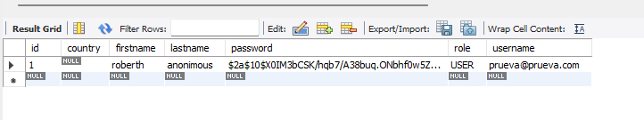

# Getting Started

### Reference Documentation
For further reference, please consider the following sections:

* [Official Apache Maven documentation](https://maven.apache.org/guides/index.html)
* [Spring Boot Maven Plugin Reference Guide](https://docs.spring.io/spring-boot/docs/3.1.2/maven-plugin/reference/html/)
* [Create an OCI image](https://docs.spring.io/spring-boot/docs/3.1.2/maven-plugin/reference/html/#build-image)
* [Spring Boot DevTools](https://docs.spring.io/spring-boot/docs/3.1.2/reference/htmlsinge/index.html#using.devtools)
* [Spring Web](https://docs.spring.io/spring-boot/docs/3.1.2/reference/htmlsinge/index.html#web)
* [Spring Data JPA](https://docs.spring.io/spring-boot/docs/3.1.2/reference/htmlsinge/index.html#data.sql.jpa-and-spring-data)
* [Spring Security](https://docs.spring.io/spring-boot/docs/3.1.2/reference/htmlsinge/index.html#web.security)

### Guides
The following guides illustrate how to use some features concretely:

* [Building a RESTful Web Service](https://spring.io/guides/gs/rest-service/)
* [Serving Web Content with Spring MVC](https://spring.io/guides/gs/serving-web-content/)
* [Building REST services with Spring](https://spring.io/guides/tutorials/rest/)
* [Accessing Data with JPA](https://spring.io/guides/gs/accessing-data-jpa/)
* [Accessing data with MySQL](https://spring.io/guides/gs/accessing-data-mysql/)
* [Securing a Web Application](https://spring.io/guides/gs/securing-web/)
* [Spring Boot and OAuth2](https://spring.io/guides/tutorials/spring-boot-oauth2/)
* [Authenticating a User with LDAP](https://spring.io/guides/gs/authenticating-ldap/)

### Installation
```
✨ Clone the repository: git clone https://github.com/juniorDeveloper8/api-web-token.git
✨ Navigate to the project directory: cd your-repo
✨ Build the project using Maven:: mvn clean install
✨ Run the project: mvn spring-boot:run
✨ Test the API Rest using Postman or another application at http://localhost:8080.
```
### Overview

This project showcases the implementation of a JWT Authentication feature in an Spring Boot application.

Technologies used:

✨ Spring Boot 3
✨ Spring Security 6
✨ jsonwebtoken

### 🚀 Project Structure

Inside of your Astro project, you'll see the following folders and files:

```
├── .mvn
├── src
│   ├── main
│   └── java/com/robert/seguridad/back
│       ├── auth
│       ├── config
│       ├── demo
│       ├── interface
│       ├── jwt
│       ├── models
│       └── BackApplication.java
├── resources
│       └── application.porperties
└── pom.xml
```
### Funtion

  

  

  

### Dependencies Spring

```
✨ Spring boot dev tools
✨ Spring web
✨ Spring data jpa
✨ Spring security
✨ Spring mysqlDiver
✨ Loobok
```